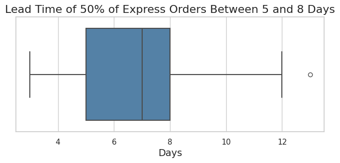

# Supply Chain Analysis: Improving Leadtime for a B2C Cereal Company

## Structure

- Introduction
- Key Findings
- 

## The Setup

The client is a B2C cereal company selling solely through their online channels to customers, no physical stores. The project has two parts: First, check the stakeholder's assumptions and reconstruct the actual process that makes up the leadtime. Second, make suggestions to improve leadtime.

## Stakeholder assumptions

According to the stakeholder:

- Step 1: orders take 3 days to process
- Step 2: when ready, they wait 1-2 days for a truck (trucks come on mondays, mednesdays and fridays)
- Step 3: delivery takes another 3 days

Additionally, step 2 can be sped up if customers pay for express shipping. Express shipments are put on trucks as soon as they are ready. This gives us an average leadtime of 7.4 in general, and 6 days for express orders.

## Results: 

### Average Lead Time is 57% higher than expected, with 11 days instead of 7

Contrary to the stakeholders assumption, the average lead time is 4 days higher than expected.

50% of all orders have a leadtime of 9 to 13 days. Only 25% of orders have a leadtime that conforms to the expectations.

If we look at the individual steps, the analysis revealed:

- Step 1: processing takes on average 4 days, which is a day more than expected
- Step 2: when ready, orders wait on average 1.5 days, which conforms to the stakeholder's hypothesis
- Step 3: Delivery takes 4.5 days on average, which is 1.5 days longer than expected

### Express Shipping influences processing time

Contrary to the stakeholders assumption, express shipping influences the processing time **and** the pickup time.

Orders with express shipping are processed 250% faster than standard shipping

## Measures

The stakeholder asked us to evaluate two scenarios: Handle all orders as express or have trucks on every day.

Trucks on every day would reduce the pickup time by 0.5 days, since orders that are ready on day 1 would still wait till day 2 to be shipped. Since the average pickup time is 1.5, the lead time wouldn't be substantially better.

Handling all orders as express would decrease leadtime by ~36% and have the processing conforming to the stakeholders initial expectations

Lastly, the client should renegotiate with the logistics provider to either pay less, or get the contractually agreed 3 days to further decrease the lead time by 1.5 days, resulting in a final 5.5 days from taking the order to it being delivered at the customer's doorstep. This would be another improvement of 21%.

